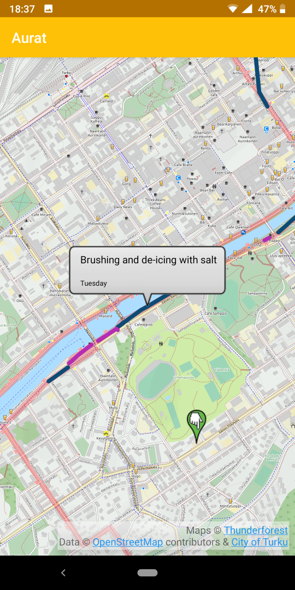
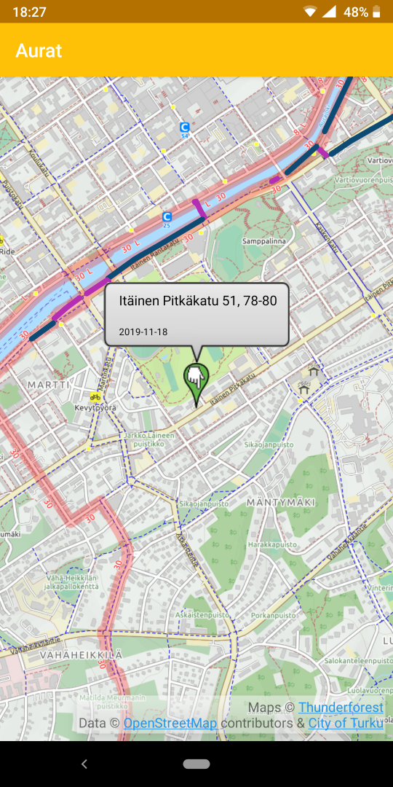

# Aurat
App for visualizing street maintenance data provided by the city of Turku

&nbsp;&nbsp;&nbsp;&nbsp;&nbsp;

## Installation
*Note: Requires Android 7.0 or newer*

Download the .apk file from /app/release/ with your phone's browser (or with your computer, and transfer it to your phone). Open the file with your phone to begin installation.

When prompted, you need to allow installation of unknown apps for the app that you are opening the file with.
